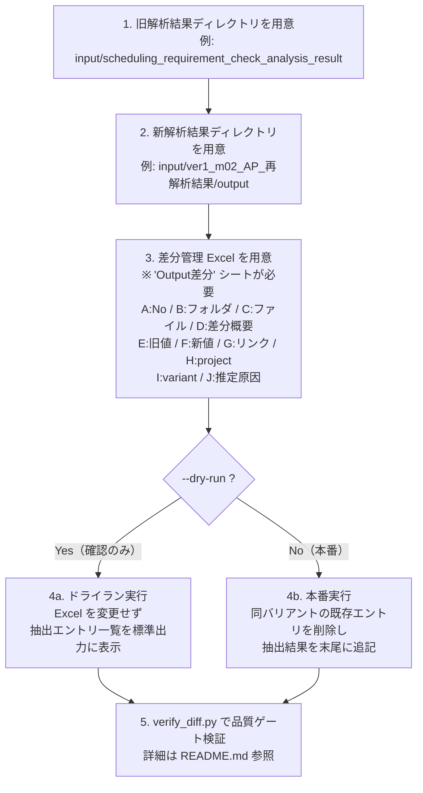
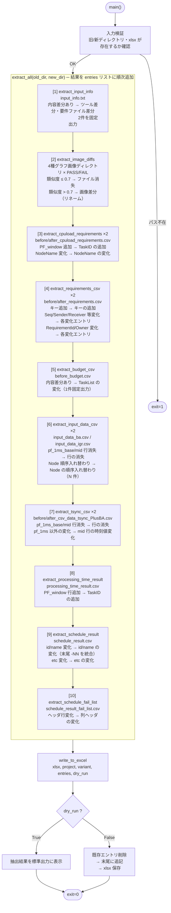
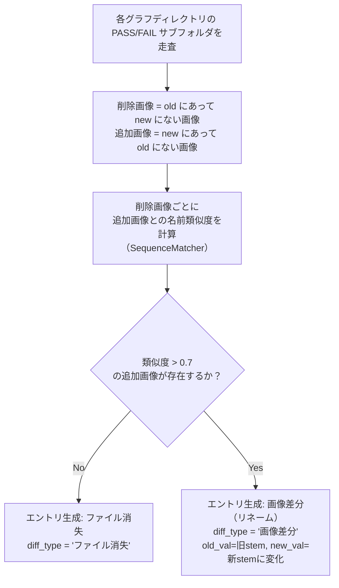
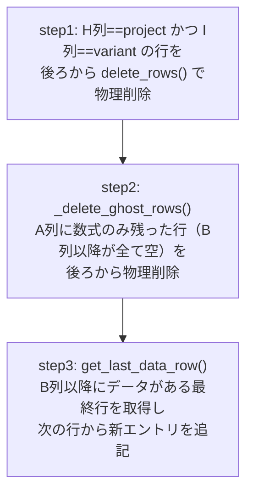

# extract_and_write_diff.py 詳細マニュアル

## 概要

旧解析結果フォルダと新解析結果フォルダを比較し、差分エントリを自動抽出して  
Excel の『Output 差分』シートに転記するツールです。

---

## 1. ユーザーワークフロー



---

## 2. 使い方（CLI リファレンス）

```bash
python3 scripts/extract_and_write_diff.py \
    --project <プロジェクト名> \
    --variant <バリアント名> \
    --old     <旧解析結果ディレクトリ> \
    --new     <新解析結果ディレクトリ> \
    --xlsx    <Excelファイルパス> \
    [--dry-run]
```

### 引数

| 引数 | 必須 | 説明 | 例 |
|------|------|------|----|
| `--project` | ✅ | プロジェクト名 | `ver1`, `ver2`, `ver2.1` |
| `--variant` | ✅ | バリアント名 | `m02`, `b01`, `m01` |
| `--old` | ✅ | 旧（過去解析済み）結果ディレクトリのパス | `input/scheduling_requirement_check_analysis_result` |
| `--new` | ✅ | 新（ver3 再解析）結果ディレクトリのパス | `input/ver1_m02_AP_再解析結果/output` |
| `--xlsx` | ✅ | Output 差分シートを含む Excel ファイルパス | `input/過去プロジェクト(...).xlsx` |
| `--dry-run` | ➖ | 指定すると Excel を書き換えず、抽出結果のみ表示する | — |

### 終了コード

| コード | 意味 |
|--------|------|
| `0` | 正常完了 |
| `1` | パスが存在しないエラー |

### 実行例

```bash
BASE=work/format-change

# ドライラン（確認のみ）
python3 "$BASE/scripts/extract_and_write_diff.py" \
    --project ver1 \
    --variant m02 \
    --old  "$BASE/input/scheduling_requirement_check_analysis_result" \
    --new  "$BASE/input/ver1_m02_AP_再解析結果/output" \
    --xlsx "$BASE/input/過去プロジェクト(ver1_ver2_ver2.1)の要件ファイルフォーマット変更.xlsx" \
    --dry-run

# 本番実行（Excel に転記）
python3 "$BASE/scripts/extract_and_write_diff.py" \
    --project ver1 \
    --variant m02 \
    --old  "$BASE/input/scheduling_requirement_check_analysis_result" \
    --new  "$BASE/input/ver1_m02_AP_再解析結果/output" \
    --xlsx "$BASE/input/過去プロジェクト(ver1_ver2_ver2.1)の要件ファイルフォーマット変更.xlsx"
```

---

## 3. 内部処理ワークフロー



---

## 4. 対象ファイルと差分抽出ロジック詳細

### [1] `input_info.txt` — `extract_input_info()`

旧/新で内容が異なる場合に以下の **2 件を固定出力** します。

| 差分概要 | 新値（説明） | 推定原因 |
|----------|------------|---------|
| 入力ファイルの差分 | 要件チェックツール差分 | ver3 ツールを用いたことによる差分 |
| 入力ファイルの差分 | 要件ファイル差分 | ver3 フォーマットを使用した要件ファイルに置き換わったことによる差分 |

> ファイルが一致している場合は 0 件。

---

### [2] グラフ画像ディレクトリ群 — `extract_image_diffs()`

対象ディレクトリ（`PASS` / `FAIL` サブフォルダ）:

- `processing_load_duration_graph`
- `Sequence_duration_graph`
- `SWC_budget_duration_graph`
- `WakeupInterval_graph`

**判定ロジック:**



| 差分概要 | 説明 |
|----------|------|
| ファイル消失 | 旧にあり新にない、かつ類似画像も見つからない場合 |
| 画像差分 | 旧→新でファイル名が類似度 0.7 超で変化（リネーム）した場合 |

---

### [3] `before/after_cpuload_requirements.csv` — `extract_cpuload_requirements()`

- **PF_window 追加**: 新 CSV に `PF_window` を含む DisplayName/NodeName が追加された場合  
  → 差分概要「TaskID の追加」、推定原因「infsimyml のフォーマット変更(1-③)」
- **NodeName の変化**: TaskID をキーに旧→新で NodeName が変化した場合  
  → 差分概要「NodeName の変化」、推定原因「infsimyml のフォーマット変更(1-①)」

---

### [4] `before/after_requirements.csv` — `extract_requirements_csv()`

| 検出内容 | 差分概要 | 推定原因 |
|----------|---------|---------|
| 新 CSV にキーが追加（例: Fsync 用 Target キー） | キーの追加 | chksimyml フォーマット変更(2-②) |
| Sequence/Sender/Receiver/FirstTask/SecondTask 列の値が変化 | Sequence/Sender/.../SecondTask の変化 | chksimyml フォーマット変更(2-①) |
| RequirementId 列の値が旧→新で変化 | RequirementId の変化 | chksimyml フォーマット変更(2-③) |
| RequirementOwner 列の値が旧→新で変化 | RequirementOwner の変化 | （原因なし） |

> `temp/` サブディレクトリ内のファイルを対象とします。Excel への folder 列は `tmp` と記録します。

---

### [5] `before_budget.csv` — `extract_budget_csv()`

旧/新で内容が異なる場合に以下の **1 件を固定出力** します。

| 差分概要 | 新値 | 推定原因 |
|----------|------|---------|
| TaskList の変化 | TaskList が Node 名で統一 | budget.yaml フォーマット変更(4-②) |

---

### [6] `input_data_ba.csv` / `input_data_igr.csv` — `extract_input_data_csv()`

| 検出内容 | 差分概要 |
|----------|---------|
| `pf_1ms_base` 行が新 CSV に存在しない | pf_1ms_base 行の消失 |
| `pf_1ms_mid` 行が新 CSV に存在しない | pf_1ms_mid 行の消失 |
| pf_1ms を除いた行で `start_clock_ms` 同一・`node` 異なるペアが存在 | Node の順序入れ替わり（N 件） |

---

### [7] `before/after_csv_data_tsync_PlusBA.csv` — `extract_tsync_csv()`

| 検出内容 | 差分概要 | 推定原因 |
|----------|---------|---------|
| `pf_1ms_base` 行が新 CSV に存在しない | pf_1ms_base 行の消失 | — |
| `pf_1ms_mid` 行が新 CSV に存在しない | pf_1ms_mid 行の消失 | — |
| pf_1ms 以外の行で差分あり（SequenceMatcher） | mid 行の時刻値変化 | infsimyml フォーマット変更(1-③) |

---

### [8] `processing_time_result.csv` — `extract_processing_time_result()`

新 CSV に `PF_window` を含む行が追加された場合:

| 差分概要 | 新値 | 推定原因 |
|----------|------|---------|
| TaskID の追加 | PF_window が追加 | infsimyml フォーマット変更(1-③) |

---

### [9] `schedule_result.csv` — `extract_schedule_result()`

| 検出内容 | 差分概要 | 推定原因 |
|----------|---------|---------|
| `id` または `name` 列の値が旧→新で変化（重複統合あり） | id/name の変化 | chksimyml フォーマット変更(2-③)（先頭エントリのみ） |
| `etc` 列の値が旧→新で変化 | etc の変化 | chksimyml フォーマット変更(2-①) |

> `id`/`name` の変化は末尾の `-NN` を除いた親名称が同一のペアを 1 件に統合します。

---

### [10] `schedule_result_fail_list.csv` — `extract_schedule_fail_list()`

1 行目（ヘッダ）または 2 行目（サブヘッダ）が旧→新で変化した場合:

| 差分概要 | 新値 | 推定原因 |
|----------|------|---------|
| 列ヘッダの変化 | SWC 名/Node 名に統一 | chksimyml フォーマット変更(2-①) |

---

## 5. Excel への書き込み仕様

| Excel 列 | 内容 |
|----------|------|
| A | No（先頭エントリは固定値 `1`、以降は `=A{前行}+1` の Excel 数式） |
| B | フォルダ名（`-` / `tmp` / グラフディレクトリ名） |
| C | ファイル名 |
| D | 差分概要（`ALLOWED_DIFF_TYPES` の値） |
| E | 旧値 |
| F | 新値 |
| G | リンク（固定文字列: `過去プロジェクト(ver1/ver2/ver2.1)の 要件ファイルフォーマット変更`） |
| H | project（`--project` 引数値） |
| I | variant（`--variant` 引数値） |
| J | 推定原因（`None` の場合は空白） |

**既存エントリの上書き手順:**



> **ゴースト行について:**  
> `delete_rows()` で行を削除した後も A 列の `=A{n}+1` 数式だけが残る場合があります。  
> step2 でこれを除去しないと `get_last_data_row()` が誤った最終行を返し、  
> 新エントリが空白行の後に追記されるバグが発生します（BUG-1/BUG-2 として修正済み）。

---

## 6. 注意事項

- 本スクリプトは **ver1/m02 で観測された差分パターン** を元に設計しています。  
  他バリアントで未知の差分パターンが存在する場合、その差分の**内容**は Excel に正しく記録されない可能性があります。  
  ただし「差分があること」自体は **バイト比較（`read_bytes()`）により常に 100% 検知**されます。
- 未知パターン（差分ありにもかかわらずエントリが 0 件のファイルが 1 件以上）を検出した場合は  
  **exit=2（FATAL）** で終了し、ロジック更新を促すメッセージを標準出力に表示します。  
  この仕組みにより、差分の**見落とし（サイレント失敗）は構造的に発生しません**。
- `--dry-run` で事前確認してから本番実行することを推奨します。
- `input/` 配下のデータファイルは Git 管理対象外です（`.gitignore` 参照）。
- Excel ファイルへの書き込みは `openpyxl` が使用するため、Excel を開いたまま実行しないでください。
