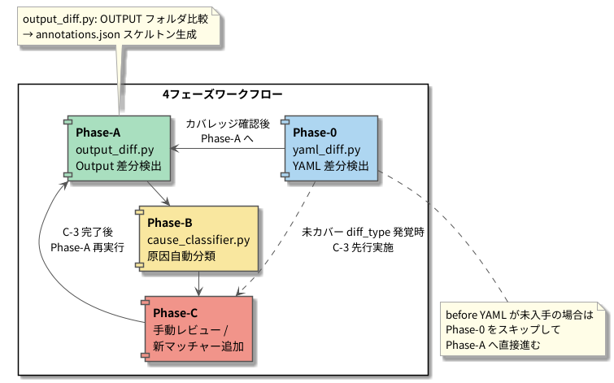
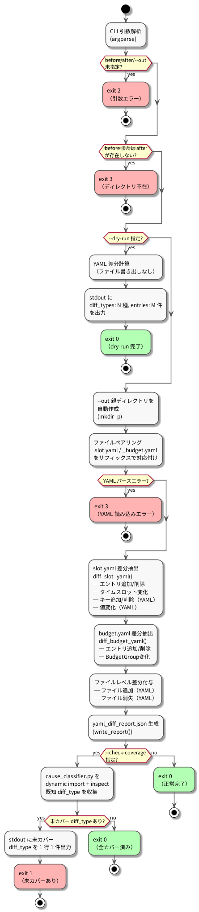

= yaml_diff.py ユーザーマニュアル
:doctype: article
:toc: left
:toc-title: 目次
:toclevels: 3
:sectnums:
:source-highlighter: rouge
:icons: font
:imagesdir: images
// ──────────────────────────────────────────────────────────
// メタ情報（AI メンテナンス用）
// tool          : scripts/yaml_diff.py
// spec          : design/yaml_diff_spec.json (v0.1.2)
// plan          : plans/yaml_diff_plan.md
// 最終更新      : 2026-05-18
// ビルド方法    : asciidoctor -r asciidoctor-diagram yaml_diff_manual.adoc
//                 ※ PlantUML はサブディレクトリ images/ に .puml を格納
// ──────────────────────────────────────────────────────────

== 概要

`yaml_diff.py` は、スケジューリング要件 YAML ファイル（`.slot.yaml` / `_budget.yaml`）の
**before（旧バージョン）** フォルダと **after（新バージョン）** フォルダを比較し、
差分種別（diff_type）単位の変化点一覧レポート（`yaml_diff_report.json`）を生成するツールです。

オプションで `cause_classifier.py` のマッチャー一覧との **カバレッジチェック** を行い、
未対応の diff_type を事前に検出できます。

=== ワークフロー上の位置づけ

// 図ソース: docs/images/yaml_diff_workflow_context.puml
// 再生成: java -jar plantuml.jar -tpng -charset UTF-8 docs/images/yaml_diff_workflow_context.puml

[cols="1,3",options="header"]
|===
| 項目              | 内容

| フェーズ          | Phase-0（YAML 差分自動検出）
| 実行タイミング    | before/after YAML が揃ったとき（Phase-A より先に実行可能）
| 入力              | before/after フォルダ（`.slot.yaml` / `_budget.yaml`）
| 出力              | `yaml_diff_report.json`（差分一覧）+ stdout（カバレッジ警告）
| スキップ条件      | before YAML が未入手の場合は Phase-0 をスキップして Phase-A へ進む
|===

== 前提条件

=== 実行環境

[source,bash]
----
# Python バージョン確認
python3 --version          # 3.8 以上

# PyYAML のインストール確認
python3 -c "import yaml; print(yaml.__version__)"   # 例: 6.0.3

# PyYAML が未インストールの場合
pip install PyYAML
----

=== ドキュメントのビルド（図を含む HTML/PDF 生成）

[source,bash]
----
# asciidoctor-diagram が必要
gem install asciidoctor asciidoctor-diagram

# HTML 生成
asciidoctor -r asciidoctor-diagram docs/yaml_diff_manual.adoc

# PlantUML ファイルの単体レンダリング（PNG 確認用）
java -jar plantuml.jar docs/images/yaml_diff_flow.puml
----

NOTE: `asciidoctor-diagram` は初回ビルド時に `.puml` ファイルを自動レンダリングし、
`images/` 下に PNG を生成します。

== クイックスタート

=== 基本実行

[source,bash]
----
python3 scripts/yaml_diff.py \
  --before input/requirement_file/m01-before \
  --after  input/requirement_file/m01-after \
  --out    output/m01_yaml_diff_report.json
----

.実行結果（標準出力）の例
[source]
----
  比較完了: 12 件 → output/m01_yaml_diff_report.json
----

=== カバレッジチェック付き実行

[source,bash]
----
python3 scripts/yaml_diff.py \
  --before input/requirement_file/m01-before \
  --after  input/requirement_file/m01-after \
  --out    output/m01_yaml_diff_report.json \
  --check-coverage design/cause_classifier_spec.json
----

未カバーの diff_type が存在する場合、stdout に表示されて終了コード `1` が返ります。

== CLI リファレンス

=== コマンド書式

[source]
----
python3 scripts/yaml_diff.py \
  --before <DIR> \
  --after  <DIR> \
  --out    <FILE> \
  [--check-coverage <SPEC_JSON>] \
  [--dry-run]
----

=== 引数一覧

[cols="3,1,5",options="header"]
|===
| 引数                          | 必須 | 説明

| `--before <DIR>`              | ✓    | before（旧バージョン）の YAML ファイルを格納したディレクトリ
| `--after <DIR>`               | ✓    | after（新バージョン）の YAML ファイルを格納したディレクトリ
| `--out <FILE>`                | ✓    | 出力レポートファイルのパス。親ディレクトリが存在しない場合は自動作成
| `--check-coverage <SPEC_JSON>`| —    | `cause_classifier_spec.json` のパス。指定すると未カバー diff_type のカバレッジチェックを実行する
| `--dry-run`                   | —    | 差分計算と stdout 出力は行うが、`--out` へのファイル書き出しをスキップする（`--out` 引数は構文上必須のまま）
|===

=== 終了コード

[cols="1,4",options="header"]
|===
| コード | 意味

| `0` | 正常完了（差分なし・差分あり問わず。`--check-coverage` で全カバー済みの場合も `0`。`--dry-run` 指定時も `0`）
| `1` | `--check-coverage` で未カバー diff_type が存在した場合
| `2` | 引数エラー（`--before` / `--after` / `--out` 未指定等）
| `3` | 入力ファイル読み込みエラー（ディレクトリ不在・YAML パースエラー）
|===

== 入力仕様

=== ディレクトリ構成

[source]
----
input/requirement_file/
  {variant}-before/
    {name}.slot.yaml        # スケジューリング要件（list 形式）
    {name}_budget.yaml      # バジェット定義（dict 形式）
  {variant}-after/
    {name}.slot.yaml
    {name}_budget.yaml
----

NOTE: before と after でファイル名が異なっていても問題ありません。ペアリングは
ファイル名ではなく **サフィックス**（`.slot.yaml` / `_budget.yaml`）で行います。
（例: `TSS4_1AR2_RC01_m01_schedreq_relax.slot.yaml` ↔ `TSS4_V1_m01.slot.yaml`）

=== .slot.yaml の形式

[source,yaml]
----
- RequirementId: AhbAhs-01
  SequenceStartTimeSlotList:
    - Timeslot2
    - Timeslot4
  SomeOtherKey: value
- RequirementId: AhbAhs-02
  SenderStartTimeSlotList:
    - Timeslot1
----

=== _budget.yaml の形式

[source,yaml]
----
BudgetGroupDefinition:
  - BudgetGroupID: M-CA1-PVM-1
    TaskList:
      - ViewMo(m01_m02)
      - ProcMo(m01)
  - BudgetGroupID: M-CA2-PVM-1
    TaskList:
      - ViewMo2
----

== 出力仕様

=== yaml_diff_report.json の形式

[source,json]
----
{
  "generated_at": "2026-05-18T10:00:00Z",
  "before_dir": "input/requirement_file/m01-before",
  "after_dir": "input/requirement_file/m01-after",
  "diff_types": ["BudgetGroup変化"],
  "entries": [
    {
      "file": "TSS4_1AR2_RC01_m01_budget.yaml",
      "diff_type": "BudgetGroup変化",
      "key_path": "M-CA1-PVM-1.TaskList",
      "before": "[\"ViewMo(m01_m02)\"]",
      "after": "[\"ViewMo\"]"
    }
  ]
}
----

NOTE: `--check-coverage` 未指定時、`uncovered_diff_types` フィールドは出力されません。
指定時のみ `"uncovered_diff_types": [...]` が JSON に追加されます。

=== トップレベルフィールド

[cols="2,1,4",options="header"]
|===
| フィールド              | 型         | 説明

| `generated_at`          | string     | 生成日時（ISO 8601 UTC 形式）
| `before_dir`            | string     | `--before` 引数値そのまま
| `after_dir`             | string     | `--after` 引数値そのまま
| `diff_types`            | string[]   | 出現した diff_type の重複なし一覧（アルファベット順）
| `entries`               | object[]   | 差分エントリの一覧（詳細は次節）
| `uncovered_diff_types`  | string[]   | `--check-coverage` 指定時のみ付与。未カバー diff_type の一覧
|===

=== entries の各フィールド

[cols="2,1,4",options="header"]
|===
| フィールド  | 型     | 説明

| `file`      | string | 比較対象のファイル名（フォルダパスなし、ファイル名のみ）
| `diff_type` | string | 差分種別（<<sec-diff-types,差分種別一覧>> を参照）
| `key_path`  | string | 差分が発生した YAML キーパス（例: `AhbAhs-01.SequenceStartTimeSlotList`）。ファイルレベル差分は空文字
| `before`    | string | before 側の値（list は JSON シリアライズ済み文字列）。エントリ追加の場合は空文字
| `after`     | string | after 側の値（list は JSON シリアライズ済み文字列）。エントリ削除の場合は空文字
|===

[[sec-diff-types]]
== 差分種別（diff_type）一覧

[cols="3,2,5",options="header"]
|===
| diff_type             | 対象ファイル     | 説明

| `エントリ追加`        | slot / budget    | after にのみ存在する RequirementId または BudgetGroupID
| `エントリ削除`        | slot / budget    | before にのみ存在する RequirementId または BudgetGroupID
| `タイムスロット変化`  | slot             | `SequenceStartTimeSlotList` または `SenderStartTimeSlotList` の値が変化
| `BudgetGroup変化`     | budget           | BudgetGroupDefinition 内の TaskList が変化
| `キー追加（YAML）`    | slot             | 同一エントリ内で after にのみ存在するキー
| `キー削除（YAML）`    | slot             | 同一エントリ内で before にのみ存在するキー
| `値変化（YAML）`      | slot             | 上記に分類されないその他の値の変化
| `ファイル追加（YAML）`| —                | after フォルダにのみ存在する YAML ファイル
| `ファイル消失（YAML）`| —                | before フォルダにのみ存在する YAML ファイル
|===

=== エントリ追加/削除・ファイルレベル差分の before/after フィールド値

[cols="3,2,2",options="header"]
|===
| diff_type              | before                              | after

| `エントリ追加`         | `""` (空文字)                       | RequirementId または BudgetGroupID
| `エントリ削除`         | RequirementId または BudgetGroupID  | `""` (空文字)
| `ファイル追加（YAML）` | `""` (空文字)                       | ファイル名
| `ファイル消失（YAML）` | ファイル名                          | `""` (空文字)
|===

== 処理フロー

// 図ソース: docs/images/yaml_diff_flow.puml
// 再生成: java -jar plantuml.jar -tpng -charset UTF-8 docs/images/yaml_diff_flow.puml

処理は以下の順序で実行されます:

. *引数検証*: `--before` / `--after` / `--out` の必須チェック（未指定 → exit=2）
. *パス存在チェック*: before/after ディレクトリの存在確認（不在 → exit=3）
. *dry-run チェック*: `--dry-run` 指定時はこの時点で YAML 差分計算 → stdout 出力 → exit=0（以降の mkdir/書き出しをスキップ）
. *出力先 mkdir*: `--out` の親ディレクトリを自動作成（`--dry-run` 時はスキップ）
. *ファイルペアリング*: サフィックス（`.slot.yaml` / `_budget.yaml`）で before/after を対応付け
. *YAML 差分抽出*: slot.yaml（6種） / budget.yaml（3種）それぞれを解析
. *レポート生成*: `yaml_diff_report.json` を書き出し
. *カバレッジチェック*（`--check-coverage` 指定時のみ）: 未カバー diff_type を stdout 出力

CAUTION: `--out` の親ディレクトリ自動作成（手順 3）は YAML パースエラー（exit=3）の場合でも
実行されます。エラー終了時に空ディレクトリが残ることがありますが、許容動作です。

== 実行例

=== 例 1: m01 バリアントの差分確認

[source,bash]
----
python3 scripts/yaml_diff.py \
  --before input/requirement_file/m01-before \
  --after  input/requirement_file/m01-after \
  --out    output/m01_yaml_diff_report.json

echo $?   # => 0
----

=== 例 2: カバレッジチェックで未カバー diff_type を検出

[source,bash]
----
python3 scripts/yaml_diff.py \
  --before input/requirement_file/m01-before \
  --after  input/requirement_file/m01-after \
  --out    output/m01_yaml_diff_report.json \
  --check-coverage design/cause_classifier_spec.json

# 未カバーがある場合の stdout 例:
# タイムスロット変化

echo $?   # => 1（未カバーあり）
----

=== 例 3: 全カバー済みの場合（差分なし）

[source,bash]
----
# before == after（同一ディレクトリ）の場合 → entries=[], diff_types=[]
python3 scripts/yaml_diff.py \
  --before input/requirement_file/m01-after \
  --after  input/requirement_file/m01-after \
  --out    output/m01_no_diff.json \
  --check-coverage design/cause_classifier_spec.json

echo $?   # => 0（差分なし → uncovered_diff_types=[]）
----

=== 例 4: before ディレクトリ不在（エラー）

[source,bash]
----
python3 scripts/yaml_diff.py \
  --before input/requirement_file/m01-before-MISSING \
  --after  input/requirement_file/m01-after \
  --out    output/m01_yaml_diff_report.json

echo $?   # => 3（ディレクトリ不在）
----

=== 例 5: dry-run でファイルを生成せず差分件数を確認

[source,bash]
----
python3 scripts/yaml_diff.py \
  --before input/requirement_file/m01-before \
  --after  input/requirement_file/m01-after \
  --out    output/m01_yaml_diff_report.json \
  --dry-run

# stdout 例:
# diff_types: 1 種, entries: 12 件

echo $?   # => 0
ls output/m01_yaml_diff_report.json 2>/dev/null || echo "ファイルなし（期待通り）"
----

NOTE: `--dry-run` 指定時は `--out` 引数を指定しても JSON ファイルは生成されません。
また、`--out` の親ディレクトリの自動作成（mkdir）もスキップします。

== 既知の制約・注意事項

[cols="1,4",options="header"]
|===
| ID   | 内容

| N-04 | 処理対象の拡張子は `.yaml` のみ（`.yml` は対象外）。実データ（`input/requirement_file/`）に `.yml` ファイルが存在しないことを確認済み（2026-05-17）
| N-05 | `.slot.yaml` に同一 RequirementId が重複する場合は **先頭エントリのみ** を使用
| N-06 | ペアリングはサフィックス単位。1 フォルダあたり同一サフィックスのファイルは **1 つを想定**（複数ある場合は先頭を使用）
| N-03 | `yaml_diff.py` の diff_type 名と `cause_classifier.py` の diff_type 名は名前空間が異なる場合がある。Phase-C C-3 実施時に統一を検討する
|===

== 関連ファイル

[cols="3,4",options="header"]
|===
| ファイル                              | 説明

| `scripts/yaml_diff.py`               | 本ツール本体（未実装 → `plans/yaml_diff_plan.md` 参照）
| `design/yaml_diff_spec.json`         | 仕様書（v0.1.2）
| `plans/yaml_diff_plan.md`            | 実装計画（IT-1〜IT-6）
| `design/cause_classifier_spec.json`  | カバレッジチェック対象（`--check-coverage` 引数に指定）
| `scripts/cause_classifier.py`        | Phase-B 原因分類ツール
| `design/workflow_spec.json`          | 4フェーズワークフロー全体仕様
|===
